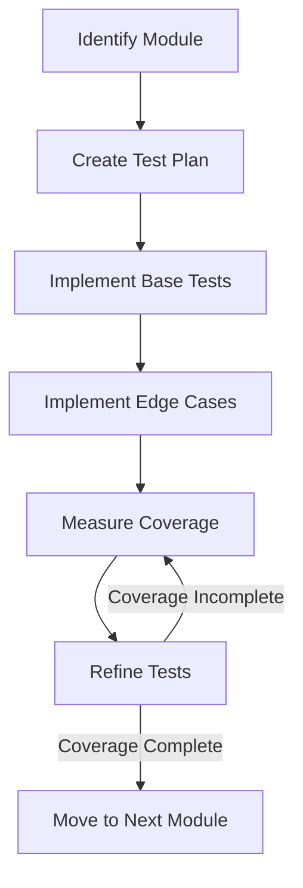

# Testing Guide

This document outlines the comprehensive testing strategy for the Agent Party system, ensuring reliability, quality, and maintainability.

## Testing Philosophy

The Agent Party project follows these key testing principles:

1. **Module-Focused Approach**: Complete one module's test coverage before moving to the next
2. **100% Coverage Target**: Aim for complete test coverage with strategic exclusions
3. **Quality Validation**: Integrate code quality checks with testing
4. **Test-Driven Development**: Write tests before implementation code
5. **Reliable Isolation**: Properly mock dependencies to test components in isolation

## Testing Strategy

### Module Progression

We follow a deliberate sequence for test development:

1. Begin with smaller, less complex modules to build momentum
2. Establish patterns that can be reused across the codebase
3. Create both positive and negative test cases for all functionality
4. Use standard fixtures and mocks for consistency



### Current Coverage Status

We've already achieved 100% test coverage for:
- src/agent_party/__init__.py
- src/agent_party/config/__init__.py
- src/agent_party/utils/app_logging.py

Modules in progress:
- src/agent_party/utils/environment.py (currently at 38%)
- src/agent_party/utils/__init__.py (currently at 78%)
- src/agent_party/__main__.py 
- src/agent_party/config/settings.py (currently at 53%)

## Test Types

### Unit Tests

Unit tests validate individual components in isolation:

```python
import pytest
from unittest.mock import AsyncMock, patch

from src.agent_party.services.agent import AgentLifecycleManager
from src.agent_party.exceptions import InvalidStateTransition

@pytest.mark.asyncio
async def test_transition_agent_state_valid():
    # Arrange
    agent_id = "test-agent-id"
    current_state = "provisioned"
    new_state = "initialized"
    agent_repo = AsyncMock()
    agent_repo.get_agent_by_id.return_value = {
        "id": agent_id,
        "status": current_state
    }
    event_publisher = AsyncMock()
    
    manager = AgentLifecycleManager(
        agent_repository=agent_repo,
        event_publisher=event_publisher
    )
    
    # Act
    await manager.transition_agent_state(
        agent_id=agent_id,
        new_state=new_state,
        approver="system"
    )
    
    # Assert
    agent_repo.update_agent_state.assert_called_once_with(
        agent_id=agent_id,
        new_state=new_state
    )
    event_publisher.publish_event.assert_called_once()
```

### Integration Tests

Integration tests verify component interactions:

```python
import pytest
from testcontainers.neo4j import Neo4jContainer

from src.agent_party.repositories.neo4j import Neo4jRepository
from src.agent_party.services.agent import AgentService

@pytest.fixture
async def neo4j_container():
    container = Neo4jContainer("neo4j:4.4")
    container.start()
    yield container
    container.stop()

@pytest.fixture
async def neo4j_repository(neo4j_container):
    uri = f"neo4j://{neo4j_container.get_container_host_ip()}:{neo4j_container.get_exposed_port(7687)}"
    repo = Neo4jRepository(uri=uri, username="neo4j", password="neo4j")
    yield repo
    await repo.close()

@pytest.mark.asyncio
async def test_agent_service_create_agent(neo4j_repository):
    # Arrange
    service = AgentService(repository=neo4j_repository)
    
    # Act
    agent_id = await service.create_agent(
        name="Test Agent",
        template_id="template-123"
    )
    
    # Assert
    agent = await neo4j_repository.get_agent_by_id(agent_id)
    assert agent["name"] == "Test Agent"
    assert agent["template_id"] == "template-123"
    assert agent["status"] == "provisioned"
```

### Property-Based Testing

Property-based testing validates behavior across a wide range of inputs:

```python
import pytest
from hypothesis import given, strategies as st

from src.agent_party.utils.validators import validate_agent_parameters

@given(
    temperature=st.floats(min_value=0.0, max_value=2.0),
    max_tokens=st.integers(min_value=1, max_value=8192),
    top_p=st.floats(min_value=0.0, max_value=1.0)
)
def test_validate_agent_parameters_valid_ranges(temperature, max_tokens, top_p):
    # Arrange
    parameters = {
        "temperature": temperature,
        "max_tokens": max_tokens,
        "top_p": top_p
    }
    
    # Act & Assert (should not raise exception)
    validate_agent_parameters(parameters)
```

### End-to-End Tests

End-to-end tests validate complete system workflows:

```python
import pytest
import asyncio
from testcontainers.compose import DockerCompose

@pytest.fixture(scope="module")
async def system_containers():
    compose = DockerCompose("./docker")
    compose.start()
    # Wait for system to be ready
    await asyncio.sleep(10)
    yield compose
    compose.stop()

@pytest.mark.asyncio
async def test_agent_creation_and_transition(system_containers, api_client):
    # Create an agent
    response = await api_client.post(
        "/agents/", 
        json={"template_id": "researcher", "name": "Research Bot"}
    )
    assert response.status_code == 201
    agent_id = response.json()["id"]
    
    # Initialize the agent
    response = await api_client.post(
        f"/agents/{agent_id}/initialize",
        json={"context": "Research task on graph databases"}
    )
    assert response.status_code == 200
    
    # Verify agent state
    response = await api_client.get(f"/agents/{agent_id}")
    assert response.status_code == 200
    assert response.json()["status"] == "initialized"
```

## Neo4j Testing

### Test Database Setup

```python
@pytest.fixture
async def setup_test_database(neo4j_container):
    """Set up a test database with initial schema and test data."""
    uri = f"neo4j://{neo4j_container.get_container_host_ip()}:{neo4j_container.get_exposed_port(7687)}"
    async with AsyncGraphDatabase.driver(uri, auth=("neo4j", "neo4j")) as driver:
        async with driver.session() as session:
            # Create constraints
            await session.run("""
                CREATE CONSTRAINT agent_id_uniqueness IF NOT EXISTS
                FOR (a:Agent) REQUIRE a.id IS UNIQUE
            """)
            
            # Create test data
            await session.run("""
                CREATE (a:Agent {id: 'test-agent-1', name: 'Test Agent', status: 'provisioned'})
                CREATE (t:Template {id: 'test-template-1', name: 'Test Template'})
                CREATE (a)-[:INSTANTIATES]->(t)
            """)

@pytest.fixture
async def cleanup_test_database(neo4j_container):
    """Clean up the test database after tests."""
    yield
    uri = f"neo4j://{neo4j_container.get_container_host_ip()}:{neo4j_container.get_exposed_port(7687)}"
    async with AsyncGraphDatabase.driver(uri, auth=("neo4j", "neo4j")) as driver:
        async with driver.session() as session:
            # Remove all test data
            await session.run("MATCH (n) DETACH DELETE n")
```

### Neo4j Performance Testing

```python
@pytest.mark.benchmark
async def test_neo4j_query_performance(neo4j_repository, benchmark):
    """Test Neo4j query performance."""
    # Create test data
    for i in range(100):
        await neo4j_repository.create_agent({
            "name": f"Agent {i}",
            "status": "provisioned",
            "capabilities": [f"capability-{i % 10}"]
        })
    
    # Benchmark the query
    result = await benchmark(
        neo4j_repository.find_agents_with_capabilities,
        ["capability-1", "capability-2"]
    )
    
    # Verify results
    assert len(result) > 0
```

## Test Coverage

### Coverage Configuration

The project uses pytest-cov for coverage reporting:

```ini
# pytest.ini
[pytest]
testpaths = tests
python_files = test_*.py
python_functions = test_*
markers =
    unit: Unit tests
    integration: Integration tests
    e2e: End-to-end tests
    benchmark: Performance benchmark tests

# .coveragerc
[run]
source = src/agent_party
omit = 
    */__init__.py
    */tests/*
    */migrations/*

[report]
exclude_lines =
    pragma: no cover
    def __repr__
    raise NotImplementedError
```

### Coverage Reporting

Generate and view coverage reports:

```bash
# Generate coverage report
pytest --cov=src/agent_party --cov-report=xml:coverage.xml --cov-report=html:coverage_html

# View HTML report
open coverage_html/index.html
```

## Mocking Strategy

### Database Mocking

```python
@pytest.fixture
def mock_neo4j_repository():
    """Create a mock Neo4j repository."""
    mock_repo = AsyncMock()
    
    # Configure common mock behaviors
    mock_repo.get_agent_by_id.return_value = {
        "id": "test-agent-id",
        "name": "Test Agent",
        "status": "provisioned"
    }
    
    mock_repo.create_agent.side_effect = lambda data: f"new-{uuid.uuid4()}"
    
    return mock_repo
```

### External Service Mocking

```python
@pytest.fixture
def mock_openai_service():
    """Mock the OpenAI service."""
    with patch("src.agent_party.services.llm.openai_client") as mock:
        # Configure the completion mock
        completion_mock = AsyncMock()
        completion_mock.return_value = {
            "choices": [
                {
                    "message": {
                        "content": "Mocked response from the language model."
                    }
                }
            ],
            "usage": {
                "prompt_tokens": 10,
                "completion_tokens": 20,
                "total_tokens": 30
            }
        }
        
        mock.chat.completions.create = completion_mock
        yield mock
```

## Continuous Integration

### GitHub Actions

The project uses GitHub Actions for continuous integration:

```yaml
# .github/workflows/test.yml
name: Test

on:
  push:
    branches: [ main, develop ]
  pull_request:
    branches: [ main, develop ]

jobs:
  test:
    runs-on: ubuntu-latest
    
    services:
      neo4j:
        image: neo4j:4.4
        env:
          NEO4J_AUTH: neo4j/password
        ports:
          - 7474:7474
          - 7687:7687
    
    steps:
      - uses: actions/checkout@v2
      
      - name: Set up Python
        uses: actions/setup-python@v2
        with:
          python-version: '3.10'
      
      - name: Install dependencies
        run: |
          python -m pip install --upgrade pip
          pip install -e ".[dev]"
      
      - name: Lint
        run: |
          black --check src tests
          isort --check-only src tests
          mypy src
      
      - name: Test
        run: |
          pytest --cov=src/agent_party tests/
      
      - name: Upload coverage
        uses: codecov/codecov-action@v1
```

## Test Organization

The project organizes tests by functionality and test type:

```
tests/
├── unit/                      # Unit tests
│   ├── repositories/          # Repository tests
│   ├── services/              # Service tests
│   └── utils/                 # Utility function tests
├── integration/               # Integration tests
│   ├── api/                   # API endpoint tests
│   ├── database/              # Database integration tests
│   └── event/                 # Event processing tests
├── e2e/                       # End-to-end tests
│   ├── scenarios/             # Business scenario tests
│   └── workflows/             # Workflow tests
├── performance/               # Performance tests
└── conftest.py                # Shared fixtures
```

## Best Practices

### Test Naming Conventions

```
test_[unit_under_test]_[condition]_[expected_behavior]
```

Examples:
- `test_create_agent_valid_input_returns_id`
- `test_transition_agent_invalid_state_raises_error`
- `test_find_agents_empty_result_returns_empty_list`

### Fixture Organization

```python
# conftest.py at project root
import pytest

# Scope: function (default)
@pytest.fixture
def basic_agent_data():
    return {
        "name": "Test Agent",
        "template_id": "template-123",
        "capabilities": ["research", "analysis"]
    }

# Scope: module
@pytest.fixture(scope="module")
def api_client():
    from httpx import AsyncClient
    client = AsyncClient(base_url="http://localhost:8000")
    yield client
    client.aclose()

# Scope: session
@pytest.fixture(scope="session")
def config():
    from src.agent_party.config import load_config
    return load_config(env="test")
```

### Test Isolation

```python
@pytest.mark.asyncio
async def test_isolated_functionality():
    # Use context managers for resource cleanup
    with TemporaryDirectory() as tmp_dir:
        # Configure test to use temporary directory
        config = Config(data_dir=tmp_dir)
        
        # Create isolated database
        db_path = os.path.join(tmp_dir, "test.db")
        repository = SqliteRepository(db_path)
        
        try:
            # Test logic
            service = Service(repository)
            result = await service.perform_operation()
            assert result is not None
        finally:
            # Clean up
            await repository.close()
```

## Troubleshooting Tests

### Common Issues and Solutions

1. **Failing Neo4j Connection in Tests**
   - Use the `AsyncSessionFactory` pattern to handle session management
   - Verify container port mapping in testcontainers setup
   - Add retry logic for database connections

2. **Asyncio Test Issues**
   - Ensure the event loop is properly managed with pytest-asyncio
   - Use `asyncio.gather()` for parallel async operations in tests
   - Check for unhandled task exceptions

3. **Mock Configuration Problems**
   - Verify the mock is patching the correct import path
   - Configure mock return values and side effects explicitly
   - Use `spec=True` for stricter method validation

### Debugging Tools

```python
# Add detailed logging in tests
@pytest.mark.asyncio
async def test_with_debug(caplog):
    caplog.set_level(logging.DEBUG)
    
    # Test code
    result = await function_under_test()
    
    # Assertions
    assert result == expected
    assert "Expected log message" in caplog.text

# Debug with breakpoints
import pdb

def test_with_breakpoint():
    # Setup
    object_under_test = create_test_object()
    
    # Add breakpoint
    pdb.set_trace()
    
    # Call function under test
    result = object_under_test.method_to_test()
    
    # Assertions
    assert result == expected
```

## Testing Roadmap

1. **Short-term Goals**
   - Achieve 100% coverage for core utility modules
   - Create integration test suite for Neo4j repository
   - Implement property-based testing for validation functions

2. **Medium-term Goals**
   - Complete API endpoint testing
   - Establish performance benchmarks for critical operations
   - Implement data consistency validation tests

3. **Long-term Goals**
   - Automated end-to-end test suite
   - Chaos engineering tests for system resilience
   - Continuous benchmark monitoring
