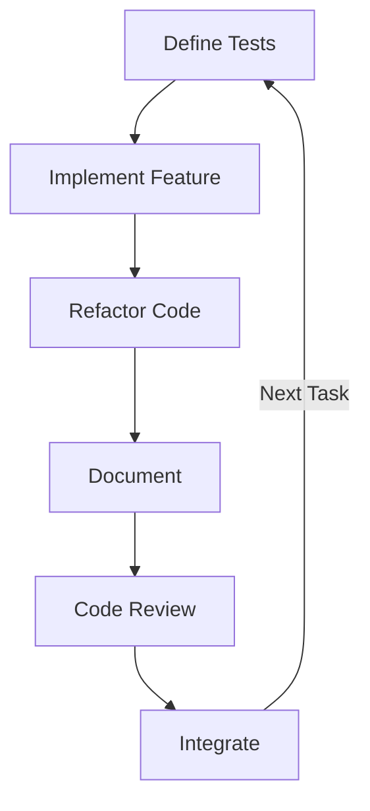

# Development Workflow Guide

This document outlines the comprehensive workflow and development practices for the Agent Party project, providing guidance on sprint execution, code quality standards, and the overall development lifecycle.

## Development Principles

### 1. Test-Driven Development

Agent Party follows a strict test-driven development approach:

- **Write Tests First**: Begin by writing tests that define expected behavior before implementing the feature
- **100% Test Coverage**: Maintain comprehensive test coverage for all code with strategic exclusions
- **Proper Mocking**: Isolate unit tests with appropriate mocking of dependencies
- **Test Suite Organization**:
  ```
  tests/
  ├── unit/                # Testing isolated components
  ├── integration/         # Testing component interactions
  ├── e2e/                 # Testing critical user workflows
  └── performance/         # System benchmark tests
  ```

### 2. Quality-First Approach

All code in the Agent Party system adheres to these quality standards:

- **SOLID Principles**: Apply single responsibility, open-closed, Liskov substitution, interface segregation, and dependency inversion
- **Protocol Interfaces**: Use Protocol classes for defining service contracts 
- **Type Annotations**: Include comprehensive type hints throughout the codebase
- **Error Handling**: Implement proper exception handling with custom exception classes
- **Validation**: Use Pydantic for data validation and schema definitions

### 3. Incremental Progress

Development proceeds through well-defined increments:

- **Module Completion**: Work on one module at a time until complete
- **Small, Testable Increments**: Create small, focused pieces of functionality
- **Clean Code Base**: Remove debug code and commented-out sections after use
- **Measurable Progress**: Track progress through completed, tested modules

## Architecture Patterns

### 1. Service Architecture

Agent Party follows a service-oriented architecture:

- **Service Registry**: Centralized registry for dependency management
- **Protocol Interfaces**: Defined service contracts through Protocol classes
- **Service Scoping**: Appropriate lifecycle management (singleton, transient, scoped)

```python
from typing import Protocol

class AgentRepository(Protocol):
    """Protocol defining the agent repository contract."""
    
    async def get_agent_by_id(self, agent_id: str) -> dict:
        """Get agent by ID."""
        ...
    
    async def create_agent(self, agent_data: dict) -> str:
        """Create a new agent."""
        ...

class Neo4jAgentRepository:
    """Implementation of agent repository using Neo4j."""
    
    def __init__(self, neo4j_client):
        self.client = neo4j_client
    
    async def get_agent_by_id(self, agent_id: str) -> dict:
        # Implementation using Neo4j
        ...
    
    async def create_agent(self, agent_data: dict) -> str:
        # Implementation using Neo4j
        ...
```

### 2. Repository Pattern

Data access follows the repository pattern:

- **Repository Interfaces**: Define data access contracts
- **Neo4j Optimization**: Optimize graph queries with proper indexing
- **Transaction Management**: Implement proper transaction handling

```python
from typing import Protocol, List

class CapabilityRepository(Protocol):
    """Protocol defining the capability repository contract."""
    
    async def get_capabilities_by_ids(self, capability_ids: List[str]) -> List[dict]:
        """Get multiple capabilities by their IDs."""
        ...
    
    async def find_capabilities_by_category(self, category: str) -> List[dict]:
        """Find capabilities that belong to a specific category."""
        ...

# Implementation in Neo4j
class Neo4jCapabilityRepository:
    """Implementation of capability repository using Neo4j."""
    
    @log_execution_time
    async def get_capabilities_by_ids(self, capability_ids: List[str]) -> List[dict]:
        async with self.driver.session() as session:
            result = await session.run(
                """
                MATCH (c:Capability)
                WHERE c.id IN $capability_ids
                RETURN c {.*} AS capability
                """,
                capability_ids=capability_ids
            )
            return [record["capability"] for record in await result.fetch_all()]
```

### 3. Event-Driven Architecture

System communication follows event-driven patterns:

- **Event Schema**: Define event schemas with Pydantic
- **Idempotent Handlers**: Implement handlers that can safely process duplicate events
- **Error Recovery**: Create proper error recovery for failed events

```python
from pydantic import BaseModel, Field
from datetime import datetime
from typing import Optional, List

class AgentStateChangeEvent(BaseModel):
    """Event emitted when an agent changes state."""
    
    event_id: str = Field(..., description="Unique ID for this event")
    agent_id: str = Field(..., description="ID of the agent that changed state")
    previous_state: str = Field(..., description="Previous agent state")
    new_state: str = Field(..., description="New agent state")
    timestamp: datetime = Field(default_factory=datetime.utcnow)
    initiator_id: str = Field(..., description="ID of the entity that initiated the state change")
    approver_id: Optional[str] = Field(None, description="ID of the entity that approved the state change")
    metadata: dict = Field(default_factory=dict, description="Additional metadata about the state change")
```

## Sprint Workflow

### 1. Sprint Planning

1. **Review Goals**: Understand sprint objectives and deliverables
2. **Task Breakdown**: Divide work into implementable units (1 day or less)
3. **Acceptance Criteria**: Define clear criteria for each task
4. **Dependencies and Risks**: Identify and plan for dependencies
5. **Documentation Planning**: Create necessary documentation templates

### 2. Development Loop

For each task in the sprint:



1. **Define Tests**: Write comprehensive tests for expected behavior
2. **Implement Feature**: Create minimal implementation to pass tests
3. **Refactor**: Clean up code while maintaining test coverage
4. **Document**: Update documentation, docstrings, and examples
5. **Code Review**: Submit for peer review with tests and documentation
6. **Integrate**: Merge to main branch after approval

### 3. Testing Strategy

Each sprint follows this testing approach:

1. **Module Focus**: Complete one module's test coverage before moving to the next
2. **Start Small**: Begin with smaller, less complex modules to build momentum
3. **Test Both Paths**: Create both positive and negative test cases
4. **Mock Dependencies**: Properly isolate unit tests from external dependencies
5. **Coverage Tracking**: Generate and review coverage reports daily

```bash
# Run all tests with coverage
python -m pytest --cov=src/agent_party tests/ --cov-report=term --cov-report=html:coverage_report

# Run only unit tests
python -m pytest tests/unit/

# Run only integration tests
python -m pytest tests/integration/
```

### 4. Quality Gates

All code must pass through these quality gates:

1. **Automated Validation**:
   - All tests passing
   - 100% test coverage
   - Linting passing (black, isort, ruff)
   - Type checking passing (mypy)
   - Documentation building without errors

2. **Manual Review**:
   - Code review by at least one team member
   - Documentation review for completeness and clarity
   - Performance validation for key operations

### 5. Sprint Completion

At the end of each sprint:

1. **Demonstration**: Present completed features
2. **Documentation Finalization**: Complete all documentation
3. **Retrospective**: Review process and identify improvements
4. **Technical Debt Management**: Document and plan for debt remediation

## Code Standards

### 1. Code Formatting and Style

```python
# Example of properly formatted code with docstrings
from typing import Dict, List, Optional

def find_matching_capabilities(
    required_capabilities: List[str],
    available_agents: Dict[str, List[str]],
    threshold: float = 0.8
) -> Optional[Dict[str, List[str]]]:
    """
    Find agents with matching capabilities above the threshold.
    
    Args:
        required_capabilities: List of capabilities required for the task
        available_agents: Dictionary mapping agent IDs to their capabilities
        threshold: Minimum match ratio required (default: 0.8)
        
    Returns:
        Dictionary mapping agent IDs to their matching capabilities,
        or None if no agents meet the threshold
    
    Raises:
        ValueError: If threshold is not between 0 and 1
    """
    if not 0 <= threshold <= 1:
        raise ValueError("Threshold must be between 0 and 1")
        
    matching_agents: Dict[str, List[str]] = {}
    
    for agent_id, agent_capabilities in available_agents.items():
        matches = [cap for cap in required_capabilities if cap in agent_capabilities]
        match_ratio = len(matches) / len(required_capabilities)
        
        if match_ratio >= threshold:
            matching_agents[agent_id] = matches
            
    return matching_agents if matching_agents else None
```

### 2. Documentation Requirements

All public code must include:

- **Docstrings**: Comprehensive documentation for classes and functions
- **Type Annotations**: Complete typing for parameters and return values
- **Examples**: Usage examples for complex functionality
- **Architecture Decisions**: Documentation of key design choices

### 3. Error Handling Strategy

```python
from typing import Optional
from pydantic import ValidationError
from src.agent_party.exceptions import AgentNotFoundError, InvalidStateTransitionError

async def transition_agent_state(
    agent_id: str,
    new_state: str,
    approver: Optional[str] = None
) -> bool:
    """
    Transition an agent to a new state with proper error handling.
    
    Args:
        agent_id: ID of the agent to transition
        new_state: State to transition the agent to
        approver: ID of the entity approving the transition
        
    Returns:
        True if transition was successful
        
    Raises:
        AgentNotFoundError: If the agent does not exist
        InvalidStateTransitionError: If the transition is not allowed
        ValidationError: If the new state is not valid
    """
    try:
        agent = await agent_repository.get_agent_by_id(agent_id)
        if not agent:
            raise AgentNotFoundError(f"Agent with ID {agent_id} not found")
            
        # Validate the transition
        if not state_machine.is_valid_transition(agent["status"], new_state):
            raise InvalidStateTransitionError(
                f"Cannot transition from {agent['status']} to {new_state}"
            )
            
        # Perform the transition
        await agent_repository.update_agent_state(agent_id, new_state)
        
        # Log the transition
        await event_publisher.publish_event(
            AgentStateChangeEvent(
                agent_id=agent_id,
                previous_state=agent["status"],
                new_state=new_state,
                initiator_id="system",
                approver_id=approver
            )
        )
        
        return True
        
    except ValidationError as e:
        logger.error(f"Validation error: {e}")
        raise
        
    except (AgentNotFoundError, InvalidStateTransitionError) as e:
        logger.error(f"State transition error: {e}")
        raise
        
    except Exception as e:
        logger.error(f"Unexpected error during agent transition: {e}")
        raise
```

## Tools and Infrastructure

### 1. Development Environment

The Agent Party project uses these tools for development:

- **Version Control**: GitHub
- **Containerization**: Docker and docker-compose for development environment
- **Testing**: pytest with pytest-cov for coverage tracking
- **Code Quality**: black, isort, ruff, and mypy
- **CI/CD**: GitHub Actions for continuous integration and deployment
- **Documentation**: Sphinx for API documentation
- **Pre-commit Hooks**: For enforcing standards before commits

### 2. Infrastructure Setup

```yaml
# docker-compose.yml example
version: '3.8'

services:
  neo4j:
    image: neo4j:4.4
    ports:
      - "7474:7474"
      - "7687:7687"
    volumes:
      - neo4j_data:/data
    environment:
      - NEO4J_AUTH=neo4j/password
      - NEO4J_dbms_memory_heap_max__size=2G
      - NEO4J_dbms_memory_pagecache_size=1G

  kafka:
    image: bitnami/kafka:latest
    ports:
      - "9092:9092"
    environment:
      - KAFKA_CFG_ADVERTISED_LISTENERS=PLAINTEXT://kafka:9092
      - KAFKA_CFG_LISTENERS=PLAINTEXT://:9092
      - ALLOW_PLAINTEXT_LISTENER=yes
    volumes:
      - kafka_data:/bitnami/kafka

  redis:
    image: redis:alpine
    ports:
      - "6379:6379"
    volumes:
      - redis_data:/data

  api:
    build:
      context: .
      dockerfile: Dockerfile
    ports:
      - "8000:8000"
    volumes:
      - ./src:/app/src
    environment:
      - NEO4J_URI=neo4j://neo4j:7687
      - NEO4J_USERNAME=neo4j
      - NEO4J_PASSWORD=password
      - KAFKA_BOOTSTRAP_SERVERS=kafka:9092
      - REDIS_URI=redis://redis:6379/0
    depends_on:
      - neo4j
      - kafka
      - redis

volumes:
  neo4j_data:
  kafka_data:
  redis_data:
```

### 3. Pre-commit Configuration

```yaml
# .pre-commit-config.yaml
repos:
  - repo: https://github.com/pre-commit/pre-commit-hooks
    rev: v4.4.0
    hooks:
      - id: trailing-whitespace
      - id: end-of-file-fixer
      - id: check-yaml
      - id: check-added-large-files

  - repo: https://github.com/pycqa/isort
    rev: 5.12.0
    hooks:
      - id: isort
        args: ["--profile", "black"]

  - repo: https://github.com/psf/black
    rev: 23.3.0
    hooks:
      - id: black

  - repo: https://github.com/charliermarsh/ruff-pre-commit
    rev: v0.0.262
    hooks:
      - id: ruff
        args: ["--fix"]

  - repo: https://github.com/pre-commit/mirrors-mypy
    rev: v1.3.0
    hooks:
      - id: mypy
        additional_dependencies:
          - types-requests
          - pydantic
```

## Definition of Done

A feature or sprint is considered complete when:

1. **Tests**: All planned features are implemented with 100% test coverage
2. **CI Pipeline**: All tests, linting, and type checking pass in CI
3. **Code Review**: All code has been reviewed and approved
4. **Documentation**: Documentation is complete and accurate
5. **Performance**: Performance benchmarks are met
6. **Quality**: No critical or high-severity bugs remain
7. **Acceptance**: All deliverables meet the acceptance criteria

## Performance Considerations

### 1. Benchmarking

```python
@log_execution_time
async def find_agents_with_capabilities(capabilities: List[str]) -> List[dict]:
    """Find agents with specific capabilities."""
    async with self.driver.session() as session:
        result = await session.run(
            """
            MATCH (a:Agent)
            WHERE a.status = 'active'
            AND ANY(cap IN $capabilities WHERE cap IN a.capabilities)
            RETURN a {.*} AS agent
            """,
            capabilities=capabilities
        )
        return [record["agent"] for record in await result.fetch_all()]
```

### 2. Database Optimization

- **Indexing**: Create appropriate Neo4j indexes for frequent queries
- **Query Optimization**: Structure queries to minimize graph traversals
- **Connection Pooling**: Implement pooling for database connections
- **Transaction Management**: Use batching for multiple operations

### 3. Performance Testing

Dedicated performance tests to validate system behavior:

```python
@pytest.mark.benchmark
async def test_team_assembly_performance(benchmark):
    """Benchmark team assembly performance."""
    # Setup test data
    capabilities = ["research", "analysis", "coding", "planning"]
    agents = [create_test_agent(i, random.sample(capabilities, 2)) for i in range(100)]
    
    # Register test agents
    for agent in agents:
        await agent_repository.create_agent(agent)
    
    # Define benchmark function
    async def assemble_team():
        return await team_assembly_service.assemble_team(
            required_capabilities=capabilities,
            team_size=5
        )
    
    # Run benchmark
    team = await benchmark(assemble_team)
    
    # Verify results
    assert len(team) == 5
    assert all(any(cap in agent.capabilities for cap in capabilities) for agent in team)
```

## Additional Resources

For more detailed information, refer to these resources:

1. **Testing Guide**: See [08_testing_guide.md](./08_testing_guide.md) for comprehensive testing approach
2. **Operational Guide**: See [07_operational_guide.md](./07_operational_guide.md) for deployment and operations
3. **Implementation Guide**: See [06_implementation_guide.md](./06_implementation_guide.md) for implementation details
4. **System Architecture**: See [02_technical_architecture.md](./02_technical_architecture.md) for system design
